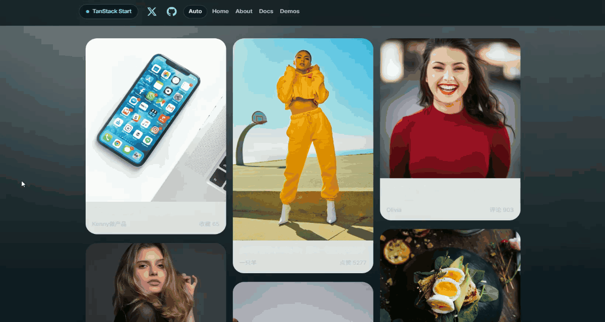

# Explore Card Overlay

使用 TanStack Router + Framer Motion 动画库实现的仿小红书卡片详情页弹出动画。



## 功能特性

- **跨路由卡片详情**：点击卡片从当前路由平滑过渡到详情 Overlay，同时 URL 同步更新为 `/explore/$id`
- **FLIP 动画效果**：利用 First-Last-Invert-Play 动画理念，实现从卡片位置到全屏 Overlay 的流畅过渡
- **响应式布局**：桌面端采用左右分栏布局，移动端采用上下垂直布局
- **键盘导航支持**：支持 ESC 键关闭详情 Overlay
- **浏览器历史集成**：支持浏览器前进/后退按钮，可通过 URL 直接访问指定卡片

## 技术栈

| 技术                                           | 用途                       |
| ---------------------------------------------- | -------------------------- |
| [TanStack Router](https://tanstack.com/router) | 文件路由系统和路由状态管理 |
| [Framer Motion](https://framer.com/motion)     | 声明式动画实现             |
| [Tailwind CSS v4](https://tailwindcss.com)     | 样式系统                   |

## 快速开始

### 环境要求

- Node.js >= 18
- Bun 或 npm/pnpm

### 安装依赖

```bash
bun install
```

### 开发模式

```bash
bun --bun run dev
```

访问 http://localhost:3000/explore 查看效果。

### 构建生产版本

```bash
bun --bun run build
```

### 代码检查

```bash
# 运行 ESLint
bun --bun run lint

# 运行 Prettier 格式化检查
bun --bun run format

# 运行全部检查
bun --bun run check
```

## 项目结构

```
src/
├── features/
│   └── explore/
│       ├── ExploreCard.tsx              # 卡片组件
│       ├── ExploreOverlay.tsx           # 详情弹窗组件
│       ├── hooks/
│       │   ├── useExploreCard.ts        # 卡片交互逻辑
│       │   └── useExploreOverlayState.ts # 核心状态管理
│       └── index.ts
├── lib/
│   └── data.ts                          # 卡片数据定义
├── routes/
│   ├── __root.tsx                       # 根路由布局
│   ├── index.tsx                        # 首页
│   ├── about.tsx                        # 关于页
│   ├── explore.tsx                      # 卡片列表页
│   └── explore.$id.tsx                  # 详情路由（虚路由）
├── router.tsx                            # 路由配置
└── styles.css                            # 全局样式和 CSS 变量
```

## 核心实现原理

### 1. 双路由策略

详情功能使用两个路由协同工作：

- **`/explore`** - 卡片列表页，渲染 `ExploreCard` 组件网格
- **`/explore/$id`** - 详情路由，实际上组件返回 `null`，仅作为 URL 状态容器

这种设计让：

- URL 可以保存和分享当前查看的卡片
- 浏览器前进/后退按钮可以正常工作
- 页面刷新后能恢复状态

### 2. URL 驱动的状态管理

```typescript
const detailId = useMemo(() => {
  const match = /^\/explore\/([^/]+)$/.exec(pathname)
  return match ? decodeURIComponent(match[1]) : null
}, [pathname])

const activeItem = detailId ? items.find((item) => item.id === detailId) : null
```

状态来源于 URL，而非独立的 React state，确保状态可序列化和可共享。

### 3. 动画过渡

使用 Framer Motion 的 `motion` 组件实现 FLIP 动画：

- **Initial**: 卡片当前位置和尺寸 (`originRect`)
- **Animate**: 目标全屏位置和尺寸 (`targetLayout`)
- **Transition**: 自定义缓动函数 `[0.22, 1, 0.36, 1]` 模拟自然运动

### 4. 为什么不用 motion 的 `layout` 和 `layoutId`？

Framer Motion 提供了 `layout` prop 和 `layoutId` 用于共享元素转场动画，看起来非常适合这种场景。但在实际应用中遇到了以下问题：

| 问题                   | 说明                                                             |
| ---------------------- | ---------------------------------------------------------------- |
| React Compiler 兼容性  | 项目使用了 React Compiler，打包后的转场动画会失效                |
| 侧边内容无退出动画     | 使用 `layoutId` 时，侧边内容区域（信息面板）无法独立控制退出动画 |
| 共享元素闪亮屏幕       | 动画过程中会出现"闪亮屏幕"的效果，用户体验不佳                   |
| 生产环境动画失效       | 开发环境正常，但打包后动画完全不触发                             |
| 跨路由 `layoutId` 丢失 | 路由切换后，`layoutId` 无法在组件间保持共享状态                  |

鉴于上述问题，最终采用了手动获取 DOM 位置 + `motion` 手动控制 `initial`/`animate` 的方案，绕过 `layoutId` 的限制。

详细原理请参考 [explore-overlay-analysis.md](./explore-overlay-analysis.md)。

## 实现过程中遇到的问题

在实现这个功能的过程中，尝试了多种方案都遇到了不同的坑：

### 方案演进

1. **最初尝试**：`/posts/index` 列表页 + `/posts/1` 详情页
   - **问题**：路由切换后，列表页会被完全卸载，无法实现转场动画

2. **父子路由统一渲染**：在父路由同时渲染列表和详情 Overlay
   - **问题**：点击卡片时，源卡片会先"淡出消失"，破坏了共享元素动画的连贯性

3. **使用 `layoutId`**：给共享元素设置唯一 `layoutId`
   - **问题**：
     - 侧边内容区域没有退出动画
     - 共享元素转场时会"闪亮屏幕"
     - 生产打包后动画失效
     - React Compiler 与 motion 的兼容性问题

4. **最终方案**：URL 驱动状态 + Overlay 同层渲染 + 手动 FLIP
   - 列表页和详情 Overlay 始终在同一个组件树中
   - 通过 `getBoundingClientRect()` 手动获取卡片位置
   - 通过 `motion.div` 的 `initial` 和 `animate` 属性手动控制动画

### 具体问题列表

- **React Compiler 打包后转场动画失效**：motion 的一些内部机制与 React Compiler 的优化冲突
- **侧边内容区域没有退出动画**：使用 `layoutId` 时，只有设置了 `layoutId` 的元素能参与动画，其他元素无法同步
- **共享元素转场时会闪亮屏幕**：motion 的 `layoutId` 在跨组件共享时会产生光晕效果
- **生产环境动画失效**：开发环境正常但打包后完全不触发，可能是 tree-shaking 或 minification 问题
- **"/posts/index 和 /posts/1" 列表页被卸载**：路由切换导致列表组件卸载，无法保留动画状态
- **父路由统一渲染但"回程前源卡片图片闪一下"**：源卡片图片在动画开始前会闪烁
- **生产环境"回程"后屏幕中间闪过黑框**：可能是 Overlay 的背景层渲染时序问题
- **列表页卡片淡出消失 + 共享元素动画同时发生**：两种动画冲突，源卡片不该在动画期间消失
- **点击时无动画，退出时只有图片有动画**：说明 `layoutId` 只绑定了图片，没有绑定整个卡片
- **卡片详情打开后，列表里的源图片仍可见**：源图片没有被正确隐藏
- **退出卡片后图片突然变大闪一下**：退出动画的终点位置计算有误
- **共享元素动画过程中被其他卡片图片遮挡**：z-index 问题，Overlay 的层叠顺序不对

这些问题的根源在于：**跨路由共享元素动画本身就是一个复杂的场景**，需要处理好路由状态、组件生命周期、DOM 位置同步、层叠上下文等多个维度。

详细原理请参考 [explore-overlay-analysis.md](./explore-overlay-analysis.md)。

Unlicense
